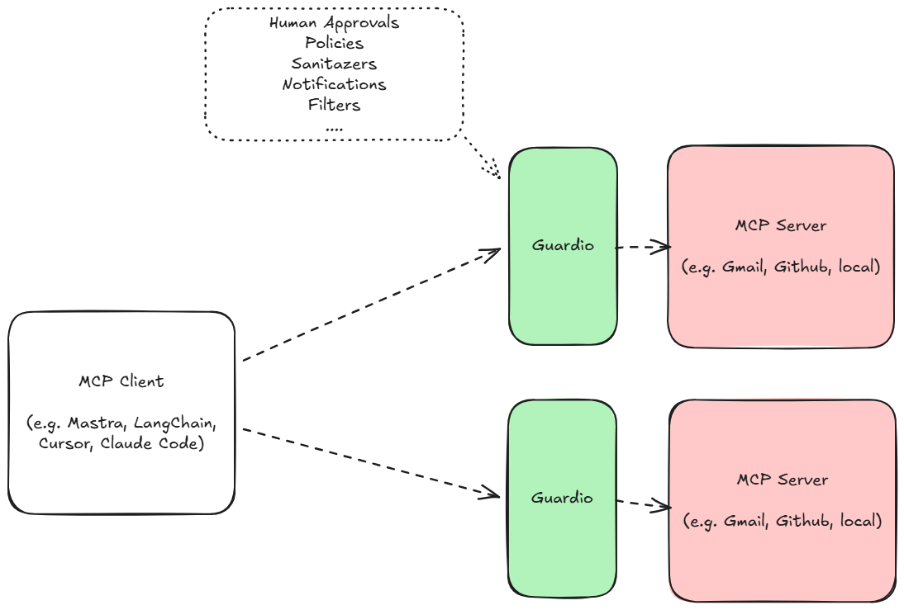

# Guardio

A framework-agnostic security layer that sits between an MCP client (e.g. AI Agent) and an MCP server. It proxies JSON-RPC and lets you do various actions on `tools/call` requests before they reach the real server. For instance, you can forbid calling tools with some parameters, sanitize the input or output, make human approval and much more - everything through the plugin system.

<p align="center">
  <picture>
    
  </picture>
</p>

## What it does

- **Proxies** stdin/stdout between the client and the real MCP server (also HTTP in the future)
- **Intercepts** `tools/call` requests and runs them through:
  1. **Policy plugins** – each can allow, block, or require approval. If any policy returns _blocked_, the call is rejected.
  2. **Intervention plugins** – each can run side effects (e.g. log, show approval UI). If any returns _reject_, the call is rejected.
- **Forwards** the call to the real MCP server only when all policies and interventions allow it.

**More functionalities will be added in the future.**

The CLI is available as `guardio` (or via `pnpm run guardio`).

## Quick start: create Guardio (per MCP server)

Scaffold a directory with a config and a bin you can point your MCP client at:

```bash
npx create-guardio
```

You will be prompted for:

- **Guardio directory** – e.g. `./my-secured-mcp` (created for you).
- **MCP Server command** – e.g. `node`, `python`.
- **MCP Server args** – e.g. path to your server script (comma-separated if multiple).

This writes **guardio.config.json** (with `server` and default plugins) and **bin/guardio** in that directory. At the end you’ll see:

```
Add to MCP client

# Copy/paste the shown command

./my-secured-mcp/bin/guardio
```

Add that path to your MCP client config (e.g. Cursor’s `mcp.json`) as the command to run for this MCP server.

Or just execute the command if you are running your MCP server locally.

## Configuration

Guardio loads a config file either from **current working directory** (when run without `--config`) or from the path given by **`--config`**. It looks for (in order):

- `guardio.config.js`
- `guardio.config.ts`
- `guardio.config.json`

The config must have a **plugins** array. It can optionally have **server** (used when you run with `--config`):

- **`server`** – optional. When present and you use `--config`, Guardio uses this instead of argv/env to run the MCP server: **`{ "type": "command", "command": "node", "args": ["path/to/server.js"] }`**. Paths in **`args`** can be **relative** (resolved from the config file’s directory) or **absolute** (used as-is).

Each **plugins** entry has:

- **`type`** – `"policy"` or `"intervention"`
- **`name`** – which plugin to use (e.g. `"default"`, `"regex"`, `"http"`)
- **`config`** – optional object passed to the plugin

### Example: `guardio.config.json`

```json
{
  "server": {
    "type": "command",
    "command": "node",
    "args": ["/path/to/your-mcp-server/index.js"]
  },
  "plugins": [
    {
      "type": "policy",
      "name": "regex",
      "config": {
        "rules": [
          {
            "name": "get_weather",
            "parameter_name": "location",
            "regex": "secret|internal|localhost",
            "flags": "i"
          }
        ]
      }
    },
    {
      "type": "intervention",
      "name": "http",
      "config": { "port": 3939, "timeoutMs": 120000 }
    }
  ]
}
```

When using **`--config /path/to/guardio.config.json`**, the **server** block above is used automatically; you don’t pass the MCP server command on the command line.

### Custom plugins (path in config)

Use a **`path`** on a plugin entry to load a custom plugin from a directory (relative to the config file or absolute). That directory must contain **`index.js`** or **`index.mjs`** (compile from `index.ts` with your build script). The module's **default export must be the plugin instance**.

For reference, check the /example plugin generated by the `npx create-guardio`.

## Running Guardio (CLI)

You must tell Guardio **which command to run** for the real MCP server (unless you use `--config` with a config that has **server**). Options:

### 1. Direct arguments

```bash
guardio node /path/to/your-mcp-server/index.js
```

### 2. After `--`

```bash
guardio -- node /path/to/your-mcp-server/index.js
```

### 3. Environment variables

```bash
export GUARDIO_COMMAND=node
export GUARDIO_ARGS=/path/to/your-mcp-server/index.js
guardio
```

Or use `MCP_REAL_TOOL_COMMAND` and `MCP_REAL_TOOL_ARGS` (comma-separated) for the same purpose.

### 4. Config file with `--config`

```bash
guardio --config /path/to/guardio.config.json
```

If the config contains **server** with **type `"command"`**, that command and args are used; no need to pass them on the command line. The config path is also used to load **plugins**.

Guardio will **spawn** that command and proxy stdin/stdout to it. Make sure a **guardio config** exists (in the current working directory or via `--config`).

## Example with Cursor MCP

Point Cursor’s MCP config to Guardio instead of the real server. Example `.cursor/mcp.json`:

```json
{
  "mcpServers": {
    "my-tool-gated": {
      "command": "node",
      "args": [
        "/path/to/guardio-draft/bin/guardio.mjs",
        "--",
        "node",
        "/path/to/actual-mcp-server/index.js"
      ]
    }
  }
}
```

Or use the built-in bin if the package is linked/installed:

```json
{
  "mcpServers": {
    "my-tool-gated": {
      "command": "guardio",
      "args": ["--", "node", "/path/to/actual-mcp-server/index.js"]
    }
  }
}
```

Cursor talks to Guardio; Guardio applies policies and interventions, then talks to your real MCP server.

## Built-in plugins

### Policy plugins

- **`default`** – Block calls by tool name. Config required: `{ blockedTools: ["tool_a", "tool_b"] }`. No default block list.
- **`regex`** – Blocks based on rules aligned to the tools/call schema. Config:
  - **`rules`** – array of:
    - **`name`** – tool name (exact match).
    - **`parameter_name`** – optional; if set, the regex is applied to this argument’s value; otherwise to the tool name.
    - **`regex`** – pattern string (if it matches, the call is blocked).
    - **`flags`** – optional RegExp flags (e.g. `"i"`).
  - **`debug`** – optional boolean; if `true`, logs evaluation details to stderr.

### Intervention plugins

- **`default`** – No-op. Config: `{}`.
- **`http`** – Starts an HTTP server and waits for user approve/reject before forwarding. Config:
  - **`port`** – default `3939`.
  - **`timeoutMs`** – approval timeout in ms; default `120000`.

## Programmatic API

You can use the core and plugins in code:

```ts
import { GuardioCore } from "@guardiojs/guardio";

const core = new GuardioCore({
  command: "node",
  args: ["/path/to/mcp-server/index.js"],
  cwd: "/path/to/dir/with/guardio.config.json", // optional
  configPath: "/path/to/guardio.config.json", // optional
});

await core.run();
```

Policy and intervention plugins are loaded from the config file; you can also implement custom plugins and register them with `PluginManager` before running the core.

## License

Apache-2.0
