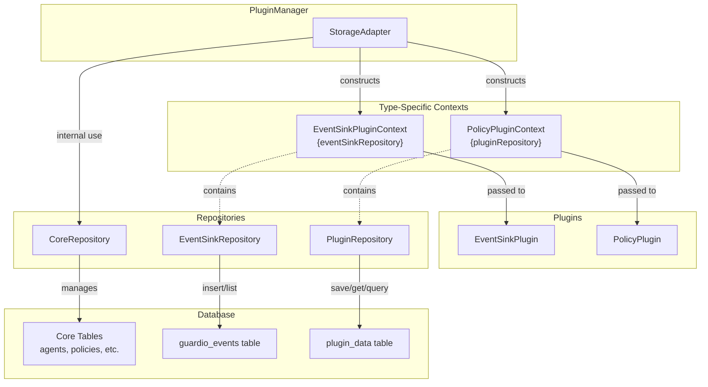
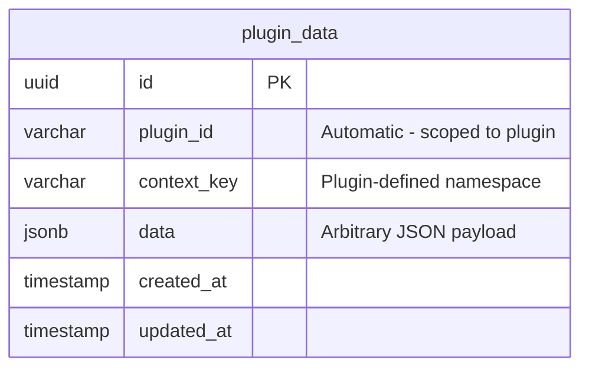
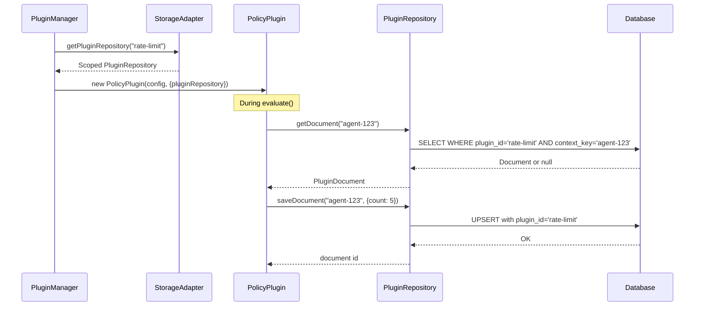

# Guardio Plugin Architecture

This document describes the plugin architecture for Guardio, focusing on how plugins interact with storage and the principle of least privilege.

## Overview

Guardio uses a pluggable architecture where different plugin types receive **type-specific contexts** containing only the repositories they need. This follows the principle of least privilege - plugins cannot access data or functionality beyond their scope.

## Plugin Types and Contexts



## Context Interfaces

### EventSinkPluginContext

Passed to EventSink plugins. Contains only the repository needed to persist events.

```typescript
interface EventSinkPluginContext {
  eventSinkRepository?: EventSinkRepository;
}
```

### PolicyPluginContext

Passed to Policy plugins. Contains a scoped repository for plugin-specific data storage.

```typescript
interface PolicyPluginContext {
  pluginRepository?: PluginRepository;
}
```

## Repository Responsibilities

| Repository | Purpose | Access |
|------------|---------|--------|
| `CoreRepository` | Agents, policy instances, assignments | Internal (PluginManager, core services) |
| `EventSinkRepository` | Insert and list GuardioEvents | EventSink plugins only |
| `PluginRepository` | Plugin-specific document storage | Policy plugins only (scoped by plugin_id) |

## Plugin Data Storage

The `PluginRepository` allows policy plugins to persist custom data using a document model:



### Scoped Access Pattern

Each plugin receives a pre-scoped `PluginRepository` that automatically filters by `plugin_id`:

```typescript
// In a policy plugin constructor
constructor(config: Record<string, unknown>, context?: PolicyPluginContext) {
  this.repo = context?.pluginRepository;
  // repo is already scoped to this plugin's name
  // All operations are automatically filtered by plugin_id
}

// Usage - no need to specify plugin_id
await this.repo.saveDocument("agent-123", { count: 5 });
await this.repo.getDocument("agent-123");
```

## Data Flow Example



## Security Model

1. **Plugin Isolation**: Each plugin can only access its own data via the scoped repository
2. **No Core Access**: Plugins cannot access `CoreRepository` (agents, policies)
3. **Type Safety**: TypeScript enforces that plugins receive the correct context type
4. **Automatic Scoping**: `plugin_id` is automatically set - plugins cannot impersonate others
